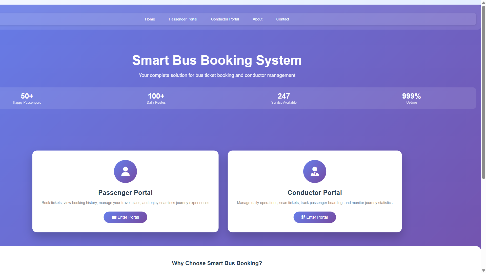
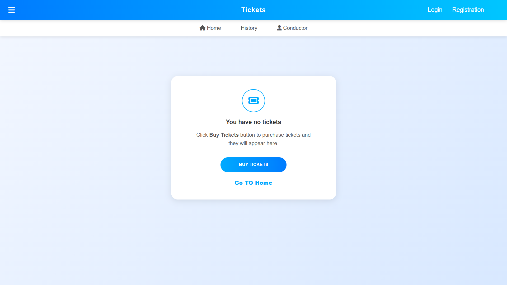
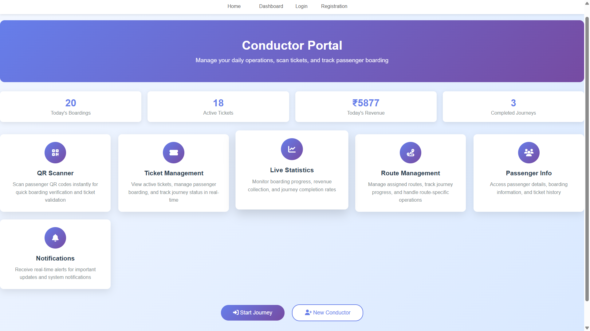
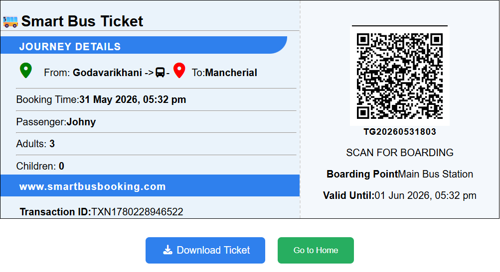

# Smart Bus Ticket Booking System

## Overview

Smart Bus Ticket Booking System is a web-based application. The system enables passengers to book tickets online and receive QR-code-based e-tickets for easy verification by conductors.

## Features

- Passenger Registration and Login
- Online Bus Ticket Booking
- QR Code Based E-Ticket Generation
- Passenger Portal
- Conductor Portal
- QR Ticket Verification by Conductor
- Secure Authentication
- Paperless Ticketing System

 

## Tech Stack

### Frontend
- HTML
- CSS
- JavaScript
- Bootstrap

### Backend
- Node.js
- Express.js

### Database
- MySQL

## Project Structure

```text
SmartBusTicketBooking/
│
├── Models/
├── controllers/
├── routes/
├── middlewares/
├── public/
├── views/
├── utils/
├── db.js
├── index.js
├── schema.js
├── package.json
└── package-lock.json 
```
## Screenshots

### Home Page 

 

### Passenger Portal 



### Conductor Portal
 

### QR Ticket 


## Future Enhancements

- Online Payment Integration
- Mobile Application Support
- Real-Time Bus Tracking


## Author

Naveen Merugu
